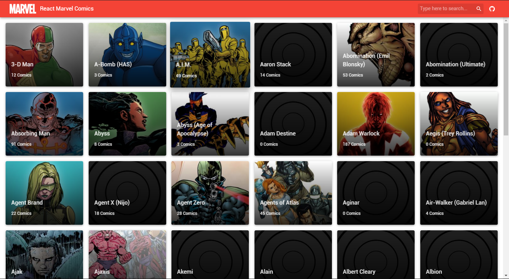

# React Marvel Comics


This is a sample React app which demonstrates how to use the marvel API with Redux and sagas to show a list of marvel characters and a list of comic books for each character.

## Important

Because the Marvel API limit our request to **3000 requests** a day, maybe the demo page will not work depend how much users are trying to run, if you can run this demo, install this project in your machine and use [your own API keys](https://developer.marvel.com/documentation/getting_started) from marvel

`./src/config/config.js`

```js
export const marvelApi = {
  publicKey: 'YOUR_PUBLIC_KEY',
  privateKey: 'YOUR_PRIVATE_KEY',
  baseUrl: 'https://gateway.marvel.com',
}
```

## Libs/Frameworks

* [React](http://reactjs.org/)
* [Redux](http://redux.js.org/)
* [Moment](https://momentjs.com/)
* [ReduxSaga](https://github.com/redux-saga/redux-saga)
* [Material UI](https://material-ui-1dab0.firebaseapp.com)

## Screenshot




## What it does?

This project contains the following features:

1. A comic list screen from marvel api
2. Each card open a dialog with a collection of comic books
3. Infinite scroll integrated with API pagination

## Get started

 ```bash
 git clone https://github.com/joaosouz4dev/react-marvel-comics.git
 cd react-marvel-comics
 yarn install
 yarn start
```

This sample was made with *Create React App* [(more information)](https://github.com/facebookincubator/create-react-app/issues/new) see the doc for requirements and using the structure of *React Marvel Catalog* [(more information)](https://github.com/thiagoterleski/react-marvel-catalog).
